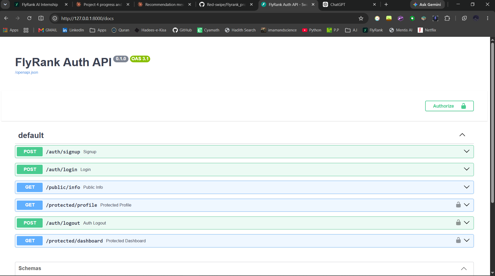

# FlyRank Auth API

## What This Project Is

FlyRank Auth API is a secure REST API built with FastAPI and Supabase Auth. It handles user signup, login, logout, and JWT-protected routes. This project is part of the FlyRank internship program.

## Setup

Clone the repository and move into the project directory:

```bash
git clone <repository-url>
cd project_4
```

Create a `.env` file in the project root with your Supabase project credentials:

```env
SUPABASE_URL=your_project_url
SUPABASE_KEY=your_anon_key
```

## How to Run

```bash
pip install -r requirements.txt
uvicorn main:app --reload
```

Server runs at [http://localhost:8000](http://localhost:8000).

Swagger docs at [http://localhost:8000/docs](http://localhost:8000/docs).

## API Reference

| Method | Endpoint | Auth Required | Description |
|---|---|---|---|
| POST | `/auth/signup` | No | Register a new user |
| POST | `/auth/login` | No | Login and receive JWT |
| POST | `/auth/logout` | Yes (Bearer) | Terminate user session |
| GET | `/public/info` | No | Public endpoint |
| GET | `/protected/profile` | Yes (Bearer) | View authenticated user profile |
| GET | `/protected/dashboard` | Yes (Bearer) | Protected dashboard |

## Swagger UI


